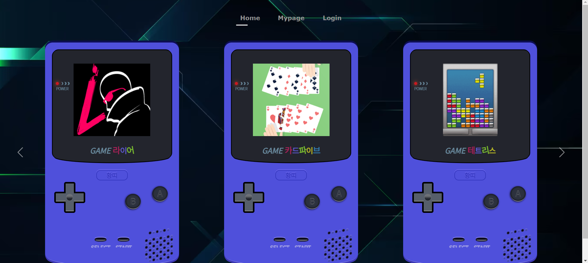
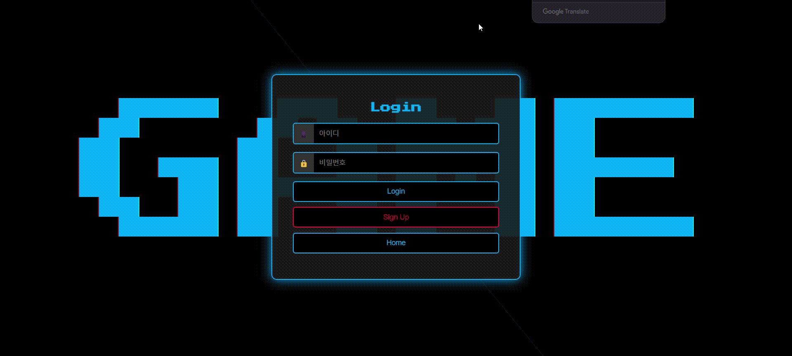

<!-- 프로젝트 로고 -->

### Recycle Project ✅

  

 

## 📝 소개
복습하고 활용할 수 있는 방법을 고민한 끝에, 통합 미니게임 사이트를 주제로 선정했습니다

- 프로젝트 소개
- 프로젝트 화면 구성
- 사용된 기술 스택
- 기술적 이슈와 해결 과정
- 프로젝트 팀원 정보

모든 관련 이미지 파일은 `readme` 폴더 안에 저장되어 있습니다.

 

### 화면 구성
| 로그인 | 마이페이지 |
|:---:|:---:|
|  |  |
<!-- | ai판독기 | 폐기물 연락처 |
|  |  |
| 재활용맵 | 탄소 중립 소개 |
|  |  | -->

기타 기능들은 ppt첨부파일 확인

 

## ⚙ 사용 기술 스택
프로젝트에서 사용된 기술 스택을 한 눈에 확인할 수 있습니다. 각 기술의 로고는 `readme/skills` 폴더에서 가져옵니다.

### Back-end

    
    
    
    

### Front-end

    
    
    

### Tools

    

 

## 🤔 기술적 이슈와 해결 과정
각자 자신이 쓴 글을 올려주세요(링크걸어주세요)
- 황재욱
    <!-- - [Stream API에 대하여](https://velog.io/@yewo2nn16/Java-Stream-API) -->

- 서성우
    <!-- - [Stream API에 대하여](https://velog.io/@yewo2nn16/Java-Stream-API) -->

- 김민준
    <!-- - [Stream API에 대하여](https://velog.io/@yewo2nn16/Java-Stream-API) -->

- 이금주
    <!-- - [Stream API에 대하여](https://velog.io/@yewo2nn16/Java-Stream-API) -->

 

## 💁‍♂️ 프로젝트 팀원
| Full-Stack | Full-Stack | Frontend | Frontend |
|:---:|:---:|:---:|:---:|
|  |   |  |  |
| [황재욱](https://github.com/jeauk) | [서성우](https://github.com/loteim) | [김민준](https://github.com/km8026) | [이금주](https://github.com/l0cyp) |

